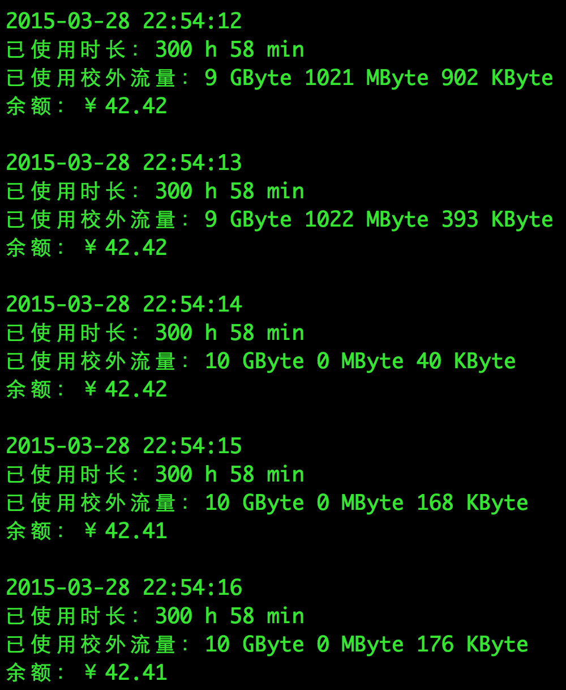

# Use | 用途

监控当前设备上登录的北邮校园网账户的流量使用情况。

# Status | 现状

作者 2015 年 6 月从北邮毕业，之后没有维护本项目。

# Dependency | 依赖

+ Python 2.x or 3.x (Tested on 2.7.6 and 3.4.2)

# Run | 运行方式

In Terminal:

    python buptInternetDataCLI.py
    
# Known Bug | 已知缺陷

+ 若是从 10.4.1.2 登录的话（aka 非宿舍的网络？），测量不准。

# Core Technology (Python 3 code) | 核心科技（Python 3 真代码）

    import http.client
    connection = http.client.HTTPConnection('10.3.8.211')
    connection.request('GET', '/')
    resp_body_str = str(conn.getresponse().read(), encoding='gb2312')
    # do_sth_to(resp_body_str)

# Duty

本 repo 的链接至少被发布到了:

https://bbs.byr.cn/#!article/BUPTNet/73425
